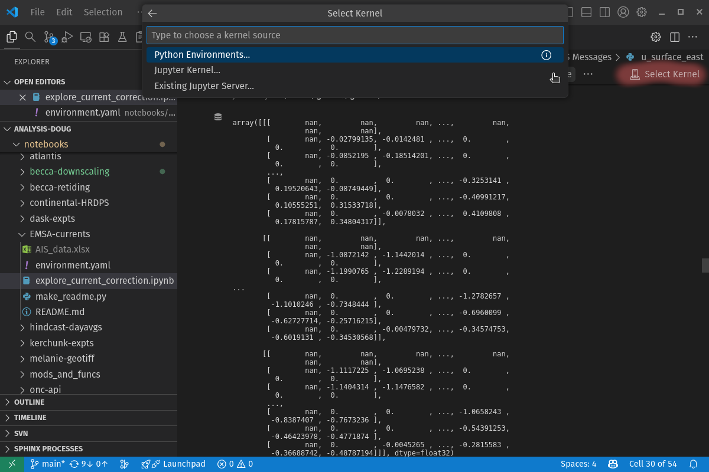

.. Copyright 2018 – present by The UBC EOAS MOAD Group
.. and The University of British Columbia
..
.. Licensed under a Creative Commons Attribution 4.0 International License
..
..   https://creativecommons.org/licenses/by/4.0/

.. _MOAD-Jupyter:

*******
Jupyter
*******

`Project Jupyter`_ is a collection of open-source software,
open-standards,
and services for interactive computing across a variety of programming languages.
We use Jupyter with Python as a core tool for analysis of model results and ocean observations,
and communication of those analyses within the MOAD group,
and with collaborators.

.. _Project Jupyter: https://jupyter.org/

`Jupyter Notebooks`_ are the core feature of Jupyter.
Notebooks contain live Python code,
equations,
visualizations,
and narrative text.
They are an excellent tool for data exploration and analysis,
teaching,
communication,
and early-stage code development.

.. _Jupyter Notebooks: https://jupyter-notebook.readthedocs.io/en/stable/

Jupyter is a server-client system,
even when you are running it on your own laptop.
The server part runs in a terminal window and is called the kernel.
It's the part that runs Python.
The client part runs in your web browser.
It's the part where you type in code,
narrative text,
LaTeX equations,
etc.
and where you see the code results and visualization images.

Jupyter provides more than one user interface,
among them:

* The original :command:`jupyter notebook` interface opens a file navigator in one tab of your browser.
  Clicking on a notebooks in that navigator tab causes it to open in another browser tab.
  You can open as many notebook tabs as you want -
  at least until your computer runs out of memory!

* The :command:`jupyter lab` is the newer "next generation" interface that puts
  everything in one browser tab with multiple panes that you can move around and re-size.
  In addition to notebooks,
  ``lab`` also provides a text editor,
  code consoles that are synced with notebooks,
  and terminal panes that give access to your system shell,
  just like your terminal program does.

* :ref:`VS Code <MOAD-VSCode>` also provides the ability to edit and run
  Jupyter notebooks directly in the VS Code interface.

:ref:`VS Code <MOAD-VSCode>` is probably the easiest way to work with Jupyter notebooks
if you are already using VS Code for other coding tasks.
However,
if you prefer the browser-based interfaces,
you should use the ``lab`` interface because that is the part of Jupyter that is being most actively developed,
and where new features are most likely to appear.

Notebooks aren't the only way to use Python though!
Code that is frequently used,
that is hundreds of lines long,
or that takes a significant amount of time to run
is often best moved from notebooks into Python modules and packages.
Doing so makes the code more maintainable,
testable,
and more efficient to run,
but at the expense of separating the code from equations,
visualizations,
and narrative text.
Those important things have to find a home in documentation that accompanies the code modules.

.. _RunningJupyterLocally:

Running Jupyter Locally
=======================

Assuming that you have :ref:`Installed Miniforge <InstallingMiniforge>` so that
you are using :command:`conda`  to create and manage your Python environments,
you can install Jupyter by adding the ``jupyterlab`` package to your environment description YAML file.
For example,
the :file:`notebooks/environment.yaml` file in your analysis repo includes ``jupyterlab``.

Using VS Code
-------------

#. Ensure that you have the Python extension installed in VS Code.
   See the :ref:`MOAD-VSCode-RecommendedExtensions` section for instructions.

#. Open the notebook file you want to work on in VS Code,
   either by using the :guilabel:`File > Open File...` menu,
   or by opening the analysis repo folder in VS Code and using the Explorer sidebar
   to navigate to and open the notebook file.

#. If the Python environment that you want to use for the notebook is not already selected,
   use the :guilabel:`Select Kernel` button in the upper right corner of the notebook editor pane
   (highlighted in the figure below)
   to choose the correct environment.
   You should see a list of available Python environments including the one you created for your analysis repo.
   Select that environment to use it as the kernel for the notebook.

The "Jupyter Notebook quick start" section of the `Microsoft Python extension`_ page
has more details and links about using Jupyter notebooks in VS Code.

.. _Microsoft Python extension: https://marketplace.visualstudio.com/items?itemName=ms-python.python

Using a Terminal Window
-----------------------

In a terminal window,
go to the directory that you want to be at the top level of Jupyter's file navigation,
and start the Jupyter server.
For example,
if you are working in your analysis repo,
the commands would be like:

.. code-block:: console

    $ cd analysis-doug/
    $ pixi run jupyter lab

The terminal window that you typed those commands into is now running the server part of Jupyter.
You have to keep it open until you are finished with Jupyter and want to shut it down.

The client part of Jupyter should have opened in a new browser tab.
If not,
follow the instructions in the terminal window that say something like:

.. code-block:: output
   :class: no-copybutton

    To access the notebook, open this file in a browser:
    file:///home/doug/.local/share/jupyter/runtime/nbserver-3581193-open.html
    Or copy and paste one of these URLs:
    http://localhost:8889/?token=f8b14419fc17ff93240a914930566fad4c2f69f064d4fdb9
    or http://127.0.0.1:8889/?token=f8b14419fc17ff93240a914930566fad4c2f69f064d4fdb9

For the older ``notebook`` interface,
the instructions are much the same,
but the command to start the server is :command:`jupyter notebook`.

When you are finished using Jupyter,
save your notebook(s) via the menu in the browser tab,
close the tab,
and use :kbd:`Ctrl-C` in the terminal window to shut down the Jupyter server.

Don't forget to commit your work in :program:`git` and push your changes to GitHub!

.. _RunningJupyterRemotely:

Running Jupyter Remotely
========================

:ref:`RunningJupyterLocally` is fine if your laptop has enough compute power for the code you are trying to run,
and if you have the data or model results files you want to work on stored on your drive.
However,
it is often better to "take the compute to the data" rather than download large data files to your laptop,
and rely on its CPU cores for calculations.
Remote machines like the MOAD workstations,
our development server ``salish``,
and the compute nodes on the Alliance ``nibi`` cluster
have more and faster CPU cores than most laptops,
and access to far larger storage.

Fortunately,
the server-client structure of Jupyter makes it relatively easy to use the CPU cores and storage of a remote system with the user interface in the browser on your laptop.
We do that by running the server part on a remote system,
and using :command:`ssh` to create a secure access "tunnel" between the server and our laptop to allow the client part running in our local browser to connect to the remote server part.
Again,
the easiest way to do that is to use :ref:`VS Code <MOAD-VSCode>` with its Remote SSH Extension.

If you decided to use the browser-based Jupyter interfaces rather than VS Code,
the :command:`jupyter lab` interface provides some useful tools on the remote system
that are similar to what you get with VS Code:

* You can open terminal panes in the ``lab`` interface to give you a terminal session
  on the remote machine for things like file system tasks:
  copying or moving files, managing permissions, etc.,
  for :command:`git` version control tasks: pulls, commits, and pushes,
  or anything else you need to do in a command-line interface.

* You can open editor panes in the ``lab`` interface to work on files stored on the remote system.
  Doing that avoids the need to copy files back and forth between your laptop and the remote system,
  or deal with network lag when you try to use a full-screen editor in a remote desktop session.
  You can use the :guilabel:`Settings > Text Editor Key Map` menu in ``lab`` to set the editor
  keyboard mapping to your choice of :program:`vim`,
  :program:`emacs`,
  or :program:`Sublime Text`.

.. _RunningJupyterRemotely-MOAD:

Running Jupyter Remotely on ``salish`` or a MOAD Workstation
------------------------------------------------------------

This section assumes that you have :ref:`Installed Miniforge <InstallingMiniforge>`
in your :envvar:`$HOME` directory on a MOAD workstation,
or that you are working in :program:`conda` environment that includes the ``jupyterlab`` package on a MOAD workstation.

.. note::
    You don't need to :ref:`Install Miniforge <InstallingMiniforge>` or ``jupyterlab``
    explicitly on ``salish`` if you have already installed it on a MOAD workstation because ``salish`` uses the same :envvar:`$HOME` file system as all of the MOAD workstations.

It is also assumed that you have followed the instructions in the :ref:`SetUpSshConfiguration` section to set up host aliases for ``salish`` and any other workstations you want to run the :command:`jupyter lab` server on.

You can use the technique in this section to run the :command:`jupyter lab` server on any of the MOAD workstations by replacing ``salish`` with the workstation name.
``salish`` has the advantages of having lots of compute power
(16 3.2 MHz cores running 2 threads each,
and 256 Gb of memory)
and of being close physically and in network terms to our large storage arrays :file:`/data/`,
:file:`/results/`,
:file:`/results2/`,
:file:`/opp/`,
and :file:`/ocean/`.
That said,
the MOAD workstations have ample compute power and are nearly as fast access to the storage arrays,
so they are well up to the task of running the :command:`jupyter lab` for analysis work.

Using VS Code
^^^^^^^^^^^^^

#. Ensure that you have the Remote SSH extension installed in VS Code.
   See the :ref:`MOAD-VSCodeRemoteSSH-Extension` section for details.

#. Use the Remote - SSH extension to open a VS Code window
   connected to ``salish`` or a MOAD workstation.

#. Ensure that you have the Python extension installed for VS Code
   *on the remote machine*.

#. If you haven't already done so,
   clone the repository containing the notebook(s) you want to use on the remote machine,
   and create the :program:`conda` environment for it.

#. Open the notebook file you want to work on in VS Code,
   either by using the :guilabel:`File > Open File...` menu,
   or by opening the analysis repo folder in VS Code and using the Explorer sidebar
   to navigate to and open the notebook file.

#. If the Python environment that you want to use for the notebook is not already selected,
   use the :guilabel:`Select Kernel` button in the upper right corner of the notebook editor pane
   (highlighted in the figure below)
   to choose the correct environment.
   You should see a list of available Python environments including the one you created for your analysis repo.
   Select that environment to use it as the kernel for the notebook.

Using a Terminal Window
^^^^^^^^^^^^^^^^^^^^^^^

To start the :command:`jupyter lab` server on ``salish``,
open a terminal window on your laptop,
and use :program:`ssh` to start a command-line session on ``salish``:

.. code-block:: console

    $ ssh salish

Once you are connected to ``salish``,
navigate to the directory that you want to be at the top level of Jupyter's file navigation,
and start the Jupyter server.
For example,
if you are working in your analysis repo,
the commands would be like:

.. code-block:: console

    $ cd analysis-doug/
    $ jupyter lab --no-browser --ip $(hostname -f)

The ``--no-browser`` option in that command tells :program:`jupyter` to start the server part only,
and not to start the client part in a browser.
The ``--ip $(hostname -f)`` causes the name of the machine you are running the server on to be used in the URLs that Jupyter sets up for the server.

You should see output in that terminal window that looks something like:

.. code-block:: output
   :class: no-copybutton

    [I 09:30:01.331 LabApp] JupyterLab extension loaded from /home/dlatorne/conda_envs/dask-expts/lib/python3.8/site-packages/jupyterlab
    [I 09:30:01.332 LabApp] JupyterLab application directory is /home/dlatorne/conda_envs/dask-expts/share/jupyter/lab
    [I 09:30:01.362 LabApp] Serving notebooks from local directory: /data/dlatorne/analysis-doug/
    [I 09:30:01.362 LabApp] Jupyter Notebook 6.1.4 is running at:
    [I 09:30:01.363 LabApp] http://salish:8888/?token=bbd686ffaa5398aacaee25c9fa44b5f9424889a81ad7d9f1
    [I 09:30:01.363 LabApp]  or http://127.0.0.1:8888/?token=bbd686ffaa5398aacaee25c9fa44b5f9424889a81ad7d9f1
    [I 09:30:01.363 LabApp] Use Control-C to stop this server and shut down all kernels (twice to skip confirmation).
    [C 09:30:01.381 LabApp]

        To access the notebook, open this file in a browser:
            file:///home/dlatorne/.local/share/jupyter/runtime/nbserver-1998772-open.html
        Or copy and paste one of these URLs:
            http://salish:8888/?token=bbd686ffaa5398aacaee25c9fa44b5f9424889a81ad7d9f1
         or http://127.0.0.1:8888/?token=bbd686ffaa5398aacaee25c9fa44b5f9424889a81ad7d9f1

.. note::
    Keep this terminal window open.
    It is where the Jupyter server part is running.
    If you close it,
    you will shutdown the Jupyter server and your :command:`jupyter lab` session will stop working.

The URLs on the last 2 lines are the important bit that we need to use to get the client running on our laptop.
The second last one that contains the name of the machine that the server is running on is the important one for the rest of this setup.
That is:

.. code-block:: output
   :class: no-copybutton

    http://salish:8888/?token=bbd686ffaa5398aacaee25c9fa44b5f9424889a81ad7d9f1

in the example output above.

The number after ``salish:`` in the URL
(``8888`` above)
is the port number that the Jupyter server is running on.
``8888`` is the default,
but if that port is busy,
probably because somebody else is already running a Jupyter server on it,
Jupyter will choose a different port number.
You need to use the port number that *your* Jupyter server server is running on in the next step when we set up the :program:`ssh` tunnel between your laptop and ``salish`` for the Jupyter client to use.

To set up the :program:`ssh` tunnel,
open a new terminal window on your laptop,
and enter the command:

.. code-block:: console

    $ ssh -N -L 4343:salish:8888 salish

This use of :program:`ssh` is called "port forwarding", or "ssh tunnelling".
It creates an ssh encrypted connection between a port on your laptop
(port ``4343`` in this case)
and a port on the remote host
(port ``8888`` on ``salish`` in this case).
The ``-N`` option tells :program:`ssh` not to execute a command on the remote system because all we want to do is set up the port forwarding.
The ``-L`` option tells :program:`ssh` that the next blob of text is the details of the port forwarding to set up.

You can use any number ``≥1024`` you want instead of ``4343`` as the local port number on your laptop.
The number after ``:salish:`` has to be the same as the port number in the URLs that the Jupyter server printed out.

.. note::
    Keep this terminal window open too.
    If you close it,
    you will collapse the :program:`ssh` port forwarding tunnel and your Jupyter server and client will stop being able to talk to each other.

.. note::
    Remember that if you are running the server part of Jupyter on a MOAD workstation like ``char`` rather than on ``salish``,
    you need to use the workstation name in 2 places in the :command:`ssh -N -L ...` command.

Finally,
open a new tab in the browser on your laptop and go to ``http://localhost:4343/`` to bring up the Jupyter client.
Use whatever port number you chose,
if you chose to use something other than ``4343`` in the :command:`ssh -N -L ...` command.
You may land on a Jupyter page that asks you to enter a :guilabel:`Password or token` to log in.
If so,
copy the the long string of digits and letters from the URL in the Jupyter server terminal windows.
For example,
the in the URL:

.. code-block:: output
   :class: no-copybutton

    http://sailsh:8888/?token=bbd686ffaa5398aacaee25c9fa44b5f9424889a81ad7d9f1

the token is ``bbd686ffaa5398aacaee25c9fa44b5f9424889a81ad7d9f1``.

When you run Jupyter in this way,
remember that all of the notebooks and files you are working with are on the remote computer (``salish``) file system,
not on your laptop.
So,
when you commit your changes with :program:`git`,
do it in a terminal session on the remote machine
(either inside Jupyter,
or in a new :program:`ssh` session).

When you are finished using Jupyter:

#. save your notebooks
#. close the browser tab
#. go to the terminal window on the remote machine where the Jupyter server is running,
   and hit :kbd:`Ctrl-c` to stop the Jupyter server
#. go to the terminal window on your laptop where you ran :command:`ssh -N -L ...`,
   and hit :kbd:`Ctrl-c` to end the port forwarding

.. _RunningJupyterRemotely-Alliance:

Running Jupyter Remotely on ``nibi``
------------------------------------

This section assumes that you have followed the instructions in the
:ref:`SetUpSshConfiguration` section to set up host aliases for ``nibi``
and any other Alliance clusters you want to run the :command:`jupyter lab` server on.

You can use the technique in this section to run the :command:`jupyter lab` server
on any of the Alliance clusters by replacing ``nibi`` with the cluster name.

The recommended way to run a :command:`jupyter lab` server on ``nibi`` is in an
interactive session on a compute node.
Things to note about working in that context:

**Pros:**
  * You get dedicated access to cores on a compute node.
  * You can request multiple cores which improves the performance of basic :command:`jupyter lab` sessions,
    and opens up the possibility of doing things like setting up an interactive :program:`dask` cluster.
**Cons:**
  * You have to request an interactive compute node session for a set period of time
    with :command:`salloc` and wait for the session to start.
  * When the time requested for your session runs out,
    the session shuts down after a 2 minute warning to give you time to save your work before it is lost.

Running :command:`jupyter lab` on a login node is not recommended because login nodes are shared resources
and you will be competing with other users for memory and CPU cores.
It is very easy to accidentally use too much memory on a login node.
That results in the kernel crashing unexpectedly.

.. note::
    The instructions in this section assume that you are using Pixi to manage your Python packages and environments.
    If you are unfamiliar with Pixi,
    see the :ref:`Pixi Package and Environment Manager <MOAD-PixiPkgAndEnvMgr>` section for an introduction to Pixi.
    The :ref:`Migrating Your Analysis Repository to Pixi <MigratingYourAnalysisRepositoryToPixi>`
    section has instructions for migrating your Conda-based analysis repository to Pixi.

In an :program:`ssh` session on ``nibi``,
start an interactive session on a compute node with:

.. code-block:: console

    $ salloc --time=1:00:00 --nodes=1 --ntasks-per-node=2 --mem-per-cpu=4096M --account=def-allen

The ``--time=1:00:00`` option requests the compute node resources for 1 hour.
``--nodes=1 --ntasks-per-node=2 --mem-per-cpu=4096M`` requests 2 cores with 4096 Mb of RAM each for the session
and stipulates that the cores be on the same node.
Those are good choices for typical interactive work on NEMO results files.
The ``--account=def-allen`` uses the MOAD allocation on ``nibi`` to request the resources.

You should see output something like:

.. code-block:: output
   :class: no-copybutton

    salloc: Pending job allocation 40482784
    salloc: job 40482784 queued and waiting for resources
    salloc: job 40482784 has been allocated resources
    salloc: Granted job allocation 40482784
    salloc: Waiting for resource configuration
    salloc: Nodes c583 are ready for job

as the requested session starts up.
There may be a wait while the resources are allocated to you,
depending on how busy the cluster is,
how long a session you have requested,
how many cores you have requested,
and how much memory you have requested.
Eventually,
your command-line prompt should re-appear showing that you are now connected to one of the compute nodes,
``c583`` in this case:

.. code-block:: console

    [your-user-id@c583.nibi ~]$

You will need the name of the compute node
(``c583`` in this case)
in subsequent steps.

Navigate to the directory that you want to be at the top level of Jupyter's file navigation,
and start the Jupyter server.
For example,
if you are working in your analysis repo,
the commands would be like:

.. code-block:: console

    [dlatorne@c583.nibi ~]$ cd MEOPAR/analysis-doug/
    [dlatorne@c583.nibi analysis-doug]$ pixi run jupyter lab --no-browser --ip=0.0.0.0 --port=8888

The ``--no-browser`` option in that command tells :program:`jupyter` to start the server part only,
and not to start the client part in a browser.
The ``--ip=0.0.0.0`` option causes the server to listen on all available network interfaces.
The ``--port=8888`` option tells the server to listen on port 8888.

You should see output in that terminal window that looks something like:

.. code-block:: output
   :class: no-copybutton

    [I 2026-09-30 17:56:09.761 LabApp] JupyterLab extension loaded from /home/dlatorne/MEOPAR/analysis-doug/.pixi/envs/default/lib/python3.14/site-packages/jupyterlab
    [I 2026-09-30 17:56:09.761 LabApp] JupyterLab application directory is /home/dlatorne/MEOPAR/analysis-doug/.pixi/envs/default/share/jupyter/lab
    [I 2026-09-30 17:56:09.769 LabApp] Extension Manager is 'pypi'.
    [I 2026-09-30 17:56:13.318 ServerApp] jupyterlab | extension was successfully loaded.
    [I 2026-09-30 17:56:13.319 ServerApp] Serving notebooks from local directory: /home/dlatorne/MEOPAR/analysis-doug
    [I 2026-09-30 17:56:13.319 ServerApp] Jupyter Server 2.17.0 is running at:
    [I 2026-09-30 17:56:13.319 ServerApp] http://c583.nibi.sharcnet:8888/lab?token=8f38c710eb2c5235f63a9930645f04d90340cdb9f413cc2f
    [I 2026-09-30 17:56:13.319 ServerApp]     http://127.0.0.1:8888/lab?token=8f38c710eb2c5235f63a9930645f04d90340cdb9f413cc2f
    [I 2026-09-30 17:56:13.319 ServerApp] Use Control-C to stop this server and shut down all kernels (twice to skip confirmation).
    [C 2026-09-30 17:56:13.408 ServerApp]

        To access the server, open this file in a browser:
            file:/home/dlatorne/.local/share/jupyter/runtime/jpserver-2008211-open.html
        Or copy and paste one of these URLs:
            http://c583.nibi.sharcnet:8888/lab?token=8f38c710eb2c5235f63a9930645f04d90340cdb9f413cc2f
            http://127.0.0.1:8888/lab?token=8f38c710eb2c5235f63a9930645f04d90340cdb9f413cc2f

.. note::
    Keep this terminal window open.
    It is where the Jupyter server part is running.
    If you close it,
    you will shutdown the Jupyter server and your :command:`jupyter lab` session will stop working.

The URLs on the last 2 lines are the important bit that we need to use to get the client running on our laptop.
The second last one that contains the name of the node that the server is running on is the important one for the rest of this setup.
That is:

.. code-block:: output
   :class: no-copybutton

    http://c583.nibi.sharcnet:8888/lab?token=8f38c710eb2c5235f63a9930645f04d90340cdb9f413cc2f

in the example output above.

Using VS Code
^^^^^^^^^^^^^

#. Open the notebook file you want to work on.

#. If the Jupyter kernel that you want to use for the notebook is not already selected,
   use the :guilabel:`Select Kernel` button in the upper right corner of the notebook editor pane
   to choose the correct kernel.
   Use the :guilabel:`Select Another Kernel -> Existing Jupyter Server` options to get to the place
   where you can paste the URL from the Jupyter server output above.

Using a Terminal Window
^^^^^^^^^^^^^^^^^^^^^^^

The URL from the Jupyter server output above is provides the information you need to use to set up
the :program:`ssh` tunnel between your laptop and ``nibi`` for the Jupyter client to use.

.. code-block:: output
   :class: no-copybutton

    http://c583.nibi.sharcnet:8888/lab?token=8f38c710eb2c5235f63a9930645f04d90340cdb9f413cc2f

The ``c583`` part is the name of the compute node on which your Jupyter server is running.
It will change from session to session.
The number after ``c583.nibi.sharcnet:`` in the URL
(``8888`` above)
is the port number that the Jupyter server is running on.
``8888`` is the default,
but if that port is busy,
probably because somebody else is already running a Jupyter server on it,
Jupyter will choose a different port number.
You need to use the port number that *your* Jupyter server server is running on in the next step
when we set up the :program:`ssh` tunnel between your laptop and ``nibi`` for the Jupyter client to use.

To set up the :program:`ssh` tunnel,
open a new terminal window on your laptop,
and enter the command:

.. code-block:: console

    $ ssh -N -L 4343:c583:8888 dlatorne@nibi.alliancecan.ca

with ``c583`` replaced by the name of the compute node that your Jupyter server is running on,
``8888`` replaced by the port number that your Jupyter server is running on,
and ``dlatorne`` replaced by your own Alliance username.

Follow the prompts to complete the multi-factor authentication process to log in to ``nibi``.

This use of :program:`ssh` is called "port forwarding", or "ssh tunnelling".
It creates an ssh encrypted connection between a port on your laptop
(port ``4343`` in this case)
and a port on the remote host
(port ``8888`` on the ``c583.nibi.sharcnet`` node in this case).
The ``-N`` option tells :program:`ssh` not to execute a command on the remote system because all we want to do is set up the port forwarding.
The ``-L`` option tells :program:`ssh` that the next blob of text is the details of the port forwarding to set up.

You can use any number ``≥1024`` you want instead of ``4343`` as the local port number on your laptop.
The number after ``:c583.nibi.sharcnet:`` has to be the same as the port number in the URLs that the Jupyter server printed out.

.. note::
    Keep this terminal window open too.
    If you close it,
    you will collapse the :program:`ssh` port forwarding tunnel and your Jupyter server and client will stop being able to talk to each other.

Finally,
open a new tab in the browser on your laptop and go to ``http://localhost:4343/`` to bring up the Jupyter client.
Use whatever port number you chose,
if you chose to use something other than ``4343`` in the :command:`ssh -N -L ...` command.
You may land on a Jupyter page that asks you to enter a :guilabel:`Password or token` to log in.
If so,
copy the the long string of digits and letters from the URL in the Jupyter server terminal windows.
For example,
the in the URL:

.. code-block:: output
   :class: no-copybutton

    http://c583.nibi.sharcnet:8888/?token=327caed3d832eefaad25a57cbf01de9f42685ced4306e036

the token is ``327caed3d832eefaad25a57cbf01de9f42685ced4306e036``.

When you run Jupyter in this way,
remember that all of the notebooks and files you are working with are on the remote computer (``nibi``) file system,
not on your laptop.
So,
when you commit your changes with :program:`git`,
do it in a terminal session on the remote machine
(either inside Jupyter,
or in a new :program:`ssh` session).

When you are finished using Jupyter:

#. save your notebooks
#. close the browser tab
#. go to the terminal window on the remote machine where the Jupyter server is running,
   and hit :kbd:`Ctrl-c` to stop the Jupyter server
#. go to the terminal window on your laptop where you ran :command:`ssh -N -L ...`,
   and hit :kbd:`Ctrl-c` to end the port forwarding
